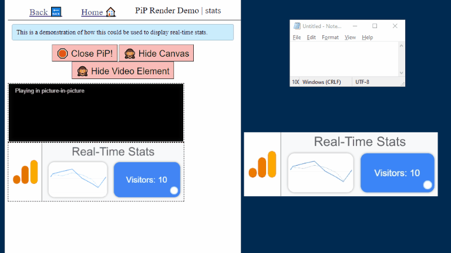
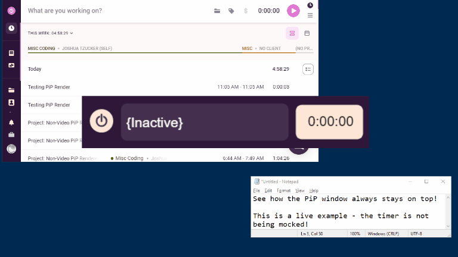

<!-- omit in toc -->
# Pip-Rendering-Fun

> An experiment in pushing the boundaries with the Browser Picture-In-Picture API; rendering arbitrary content to PiP as a second app window!

	
Table of Contents

- [Live Demos](#live-demos)
- [Intro](#intro)
- [Why](#why)
- [How This Works](#how-this-works)
	- [Quirks and Caveats](#quirks-and-caveats)
- [Excited for the Future!](#excited-for-the-future)
	- [*"Picture-in-Picture for arbitrary content"*](#picture-in-picture-for-arbitrary-content)
	- [Multi-Screen Window Placement](#multi-screen-window-placement)
- [Wrap-Up](#wrap-up)

## Live Demos
To try all the demos, head to [pip-rendering-fun.netlify.app](https://pip-rendering-fun.netlify.app).

Here is a sample of what one of them ("Stats") looks like:

And here is a demo that is running on a real website - showing how PiP could be used as a way to keep on eye on time tracking:

	
Time Tracker Demo

## Intro
For those not familiar, [the `Picture-in-Picture` API](https://developer.mozilla.org/en-US/docs/Web/API/Picture-in-Picture_API) (aka *PiP*) is an experimental web API that allows for websites to "pop" a video player on the page out, and have it continue playing as a floating window that will *always* stay on top of all other windows.

This repo is a loader and set of demos to show how you can render arbitrary content in a PiP, other than just plain video files, using some creative approaches.

## Why
I'll be honest; when the PiP feature arrived in my browser(s), it was probably the most excited I had gotten about a new browser feature in... well, a long time. I do a lot of multi-tasking, and I often have videos or other multimedia running while I work; the ability to float that content wherever I want, without all the cruft of a whole other browser window, is something I've wanted (and worked around) for a long time.

> 💡 Tip: If you are looking for a tool that enables PiP on sites that have tried to explicitly disable it (*cough* hulu *cough*), I have [a bookmarklet](https://joshuatz.com/custom-tools/2020/video-pip-picture-in-picture-enabler-bookmarklet/) you might be interested in.

However, recently I got to thinking about how, beyond the specifics, the basic idea of letting a website render content outside the primary document / tab is actually pretty revolutionary. In fact, when you think about it, this could be the start of a major shift in web apps. Currently, one of the major advantages of building your application as a native desktop app instead of a web app / PWA, is the ability to spawn *multiple* windows and tightly control the *desktop* part of the application. Expanding the PiP API to encapsulate part of this capability would be a massive step forward for web apps (in my opinion).

> 📃 Note: I haven't forgotten about popups, but I don't view them as being equal in functionality or appearance. And, they cannot be "stickied" on top.

The way PiP is *currently* implemented, it is not designed to support rendering non-video, arbitrary content, but in my fascination with how PiP could be expanded, I ended up creating this project to show how it is possible to workaround this restriction (within limits) and what the future could look like for PiP.

## How This Works
At the moment ([more on this later](#excited-for-the-future)), the PiP specification and all its implementations across different browsers have it tied to a `<video>` element. The way it works is that you, or the user, requests that a floating PiP window be connected to the video player and spawned, and the browser handles the entire process from there. The video content that is playing in the `<video>` element will start playing in the PiP floating window instead, and if the PiP window is closed, it will revert back to the in-page player.

> 🔗 [Here is a quick place to try it out](https://googlechrome.github.io/samples/picture-in-picture/).

You might think that this limits the content of a PiP window to video, which is mostly true, but as this repo shows, there are some creative ways to get around this. The main way is by using a `<canvas>` element as the source for a video stream ([via `captureStream()` and video.srcObject](https://developers.google.com/web/updates/2016/10/capture-stream)), and then drawing whatever you want on the Canvas. Another way would be to use [the MediaSource API](https://developer.mozilla.org/en-US/docs/Web/API/MediaSource) to dynamically construct a source, and then connect it to the video element with an Object URL.

### Quirks and Caveats
The PiP API is still evolving and in an experimental stage. Although Chromium browsers have largely shipped full support for the feature (Chrome shipped by default [starting with v. 71](https://www.chromestatus.com/feature/5729206566649856)), there are many browsers that either don't support it, or support it in an unusual way ([CanIUse table](https://caniuse.com/picture-in-picture)).

For example, [in Firefox](https://support.mozilla.org/en-US/kb/about-picture-picture-firefox) the PiP floating window can ***only*** be launched by the ***user***, not via JavaScript. Furthermore, there are some config flags that control some interesting defaults - namely that even if the feature is enabled, the "open" button will only show if the video duration is longer than 45 seconds.

Finally, the biggest caveat with current PiP rendering and my workaround is that the content is non-interactive; you cannot capture clicks that happen inside it, so you can only use it as a secondary display space.

> 📃 For more info on PiP and its quirks, see [my reference page in this repo](./PIP-Notes-and-Quirks.md).

## Excited for the Future!
Shoehorning support for arbitrary content into PiP via Canvas, as I've done here, is obviously not the ideal solution. However, I am *very* excited about some proposed future web APIs that could natively support the kind of functionality I have been envisioning.

### *"Picture-in-Picture for arbitrary content"*
This is a proposal that would expand the specification and implementation for PiP to include rendering arbitrary content, and possibly supporting *interactive* content. If this is embraced, in the future you might be able to just pass an entire HTML DOM to `requestPictureInPicture()` and have it displayed in a floating PiP window, complete with interaction support.

This would likely be a revision to the existing spec, rather than a break from it. The original specification carefully leaves room for this type of addition:

> "The API only applies to `HTMLVideoElement` at the moment but is meant to be extensible."   - [w3.org/TR/picture-in-picture/#intro](https://www.w3.org/TR/picture-in-picture/#intro)

In fact, [the *explainer* for the new functionality](https://github.com/w3c/picture-in-picture/blob/0d3443822a94b0ac7dfe60bcaf0b51d3d06ac35d/v2_explainer.md) is even called "V2".

	
 🔗 More Details and Links

- Chromium:
	- [Chromium Implementation Documentation](https://docs.google.com/document/d/1zZwiNkLn24SvTMmnXj6AgGK88jZhkaxexUiZr-hOfsU/edit#)
	- [Chrome Feature Tracker](https://chromestatus.com/feature/4844605453369344)
	- [Chromium bug tracker](https://bugs.chromium.org/p/chromium/issues/detail?id=953957) (on hold)
	- [Intent to Implement Discussion](https://groups.google.com/a/chromium.org/g/blink-dev/c/uK0hyACy_fg/m/XXFsm_4kDAAJ?pli=1)
- W3C
	- Picture-in-Picture Repo: [v2 Branch](https://github.com/w3c/picture-in-picture/tree/v2)
	- Picture-in-Picture Repo: [Issues tagged as v2](https://github.com/w3c/picture-in-picture/issues?q=label%3Av2+)
	- Picture-in-Picture Repo: [Main v2 Issue (#113)](https://github.com/w3c/picture-in-picture/issues/113)

### Multi-Screen Window Placement
It's slightly confusing how this feature exists in the landscape of Browser Vendors, W3C, community groups, and specifications, but it is promising all the same.

Also known as "Cross-Screen Window Placement", at its core, the feature implements and enhances web APIs around popups (spawned via `window.open`), to allow for precise placement and knowledge of location across multiple displays.

This API actually has a lot of advantages over PiP, because you can pick where windows are placed, and you are not limited to a single window at a time. To that point, [the "Use Cases" section of the Explainer](https://github.com/webscreens/window-placement/blob/master/EXPLAINER.md#use-cases) discusses the exact kind of web apps I have been thinking of; dashboards, control widgets, financial apps, etc.

I think the ideal solution might be one that combines the two ideas; if perhaps `window.open` accepted a setting of `zIndex` or `keepOnTop: true`, so that a cross-screen window could act like a PiP, with precise placement. If you combined this with the concept of the PWA display type of `minimal-ui`, you could have a popup that basically looks and behaves like a PiP window.

	
 🔗 More Details and Links

- Chromium
	- [Chrome Feature Tracker](https://www.chromestatus.com/feature/5252960583942144)
	- [Chromium bug tracker](https://bugs.chromium.org/p/chromium/issues/detail?id=897300)
	- [Demo](https://michaelwasserman.github.io/window-placement-demo/)
- Second Screen Community Group (W3C community group, not core)
	- [Window-Placement Repo](https://github.com/webscreens/window-placement)
	- [Specification](https://webscreens.github.io/window-placement/) (draft)

## Wrap-Up
Honestly, I hope that in the near future this whole repo becomes pointless due to browsers implementing improvements around floating window controls (as discussed above). It is exciting to think of a future where more applications can be run directly in the browser, no installation necessary, and this would be a step towards that goal.

<!-- omit in toc -->
## About Me:

 - 🔗<a href="https://joshuatz.com/" rel="noopener" target="_blank">joshuatz.com</a>
 - 👨‍💻<a href="https://dev.to/joshuatz" rel="noopener" target="_blank">dev.to/joshuatz</a>
 - 💬<a href="https://twitter.com/1joshuatz" rel="noopener" target="_blank">@1joshuatz</a>
 - 💾<a href="https://github.com/joshuatz" rel="noopener" target="_blank">github.com/joshuatz</a>